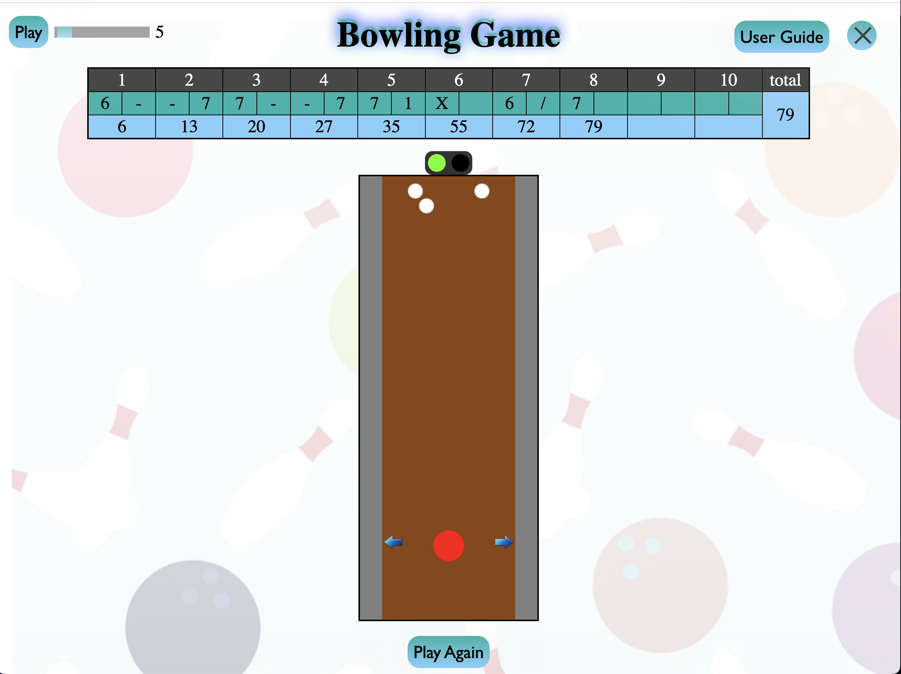

A bowling Game
Description: This is a bowling game with where user will be able to 
1) move the bowling ball to the left or right position.
2) click the ball to grab it, drag it to the direction and position they like.
3) shoot the bowling balls to hit the pins and the scoreboard will be correspondingly updated. 
4) exit the game in the mid of playing 
5) see the final score in a pop-up window.

Technologies Used:  JavaScript, HTML, CSS
Getting Started: 

Next Steps: 
1. add the power indicator and change power , may include the indicator of the direction the ball is going?  
2. add more CSS so it is visually more appealing. 
3. add a table to track gamer' score and record. 
4. make game and canvas responsive 
   

